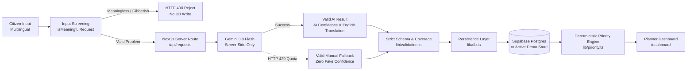

# Project Memory — JanSanket

## Project Purpose
JanSanket is an AI-powered Digital Public Good prototype that converts multilingual citizen development requests into district/category demand signals and transparent infrastructure-planning priority evidence. It addresses the gap between fragmented citizen feedback and macro-level public infrastructure planning in India.

---

## Current Implemented MVP (Milestone 5 + Post-M5 Stabilization Complete)

### Implemented Workflow


### 1. Three Distinct Intake States
- **State 1: VALID AI RESULT**
  - Trigger: Successful Gemini 3.8 Flash analysis.
  - UI: Displays *Analyzed by Gemini 3.8 Flash* badge, genuine AI confidence (e.g. 94%), original citizen text, and an English normalized summary.
  - Explanatory banner explains Gemini's role in structuring citizen language for district aggregation (and clarifies that Gemini does NOT calculate priority scores).
- **State 2: VALID MANUAL FALLBACK**
  - Trigger: Gemini HTTP 429 quota exhaustion or backend timeout.
  - UI: Displays *Manual Fallback Review (AI Unavailable)* badge and *AI Confidence: Not Available* (**zero fake confidence**).
  - Synthesizes a genuine English category summary (never copies raw Indic text into English fields).
  - Never defaults to Ramanagara; user must explicitly verify and select a supported district.
  - Requires explicit user checkbox confirmation before submission.
- **State 3: INVALID REQUEST**
  - Trigger: Meaningless text, keyboard mash (`sdgsafdasafd`), greetings, test spam, casual statements (`hello there how are you`, `this is a test`, `I like apples`).
  - Screened by `isMeaningfulRequest()` in `lib/validation.ts`.
  - Blocked with HTTP 400: *"Please describe a real infrastructure or public-service problem."*
  - Zero AI confidence, zero district default, zero database write.

### 2. Demo Scope & Boundary Protection
- **Pilot Coverage:** Strictly 8 districts across 4 states (Karnataka: Ramanagara, Tumakuru; UP: Bahraich, Varanasi; Rajasthan: Barmer, Dausa; Tamil Nadu: Dharmapuri, Madurai).
- **State-District Pair Matching:** State and district are strictly validated as a matching pair.
  - Example: `State = Goa, District = Ramanagara` is rejected (Ramanagara belongs to Karnataka, not Goa).
  - Example: `State = Goa, District = Anjuna` is rejected (outside pilot coverage).
  - Supported pilot district dropdown automatically derives and locks the valid state.

### 3. Safe Multilingual Demo Examples
- Renamed to *"Try an example (Demo content)"* with 4 diverse cases:
  1. `ಕನ್ನಡ (Roads - Ramanagara)`: Village road monsoon washout.
  2. `हिन्दी (Water - Bahraich)`: Drinking water shortage and broken handpumps.
  3. `தமிழ் (Healthcare - Dharmapuri)`: Primary health center doctor shortage.
  4. `English (Sanitation - Varanasi)`: Open drainage overflow and health risks.
- Clearly marked with a demo badge; requires clicking *Analyze Request* and checking an explicit demo submission acknowledgment checkbox before submission (prevents accidental submission traps).

### 4. Plain-Language Planner Dashboard (`/dashboard`)
- Replaced technical jargon with plain civic terms:
  - Total Citizen Requests $\rightarrow$ **Citizen Demand**
  - Districts Covered $\rightarrow$ **Districts Monitored** (8 pilot districts)
  - Active Hotspots $\rightarrow$ **High-Need Areas**
  - Demand Score (40%) $\rightarrow$ **Citizen Demand (40%)**
  - Infrastructure Gap (30%) $\rightarrow$ **Infrastructure Need (30%)**
  - Population Impact (15%) $\rightarrow$ **People Affected (15%)**
  - Planned Coverage $\rightarrow$ **Current Coverage**
  - Unaddressed Gap (15%) $\rightarrow$ **Unaddressed Need (15%)**
  - Hotspot Evidence Breakdown $\rightarrow$ **Why This Area Needs Attention**
- Mathematical integrity preserved:
  $$\text{Priority Score} = 0.40 \times \text{Demand} + 0.30 \times \text{Need} + 0.15 \times \text{People Affected} + 0.15 \times \text{Unaddressed Need}$$

### 5. Database Write Security & Supabase Fallback Hardening
- **RLS Write Security:** `citizen_requests` INSERT access is restricted strictly to `service_role` via `supabase/migrations/20260929000004_fix_write_security.sql`. Browser/client anonymous direct inserts are completely blocked.
- **Fail-Safe Persistence:** `lib/db.ts` throws an explicit error when Supabase is configured but a write fails (returning HTTP 503), preventing false success reports.
- **Provider Status:** UI indicates whether requests were saved to *Supabase Postgres* or the *Active Demo Store*.

---

## Gemini 429 Investigation Findings
- **API Model:** `gemini-3.8-flash` via Google Generative Language REST API (`/v1beta/models/gemini-3.8-flash:generateContent`).
- **Configuration:** `GEMINI_API_KEY` is correctly configured in `.env.local`.
- **Root Cause of HTTP 429:** The Google Cloud project associated with this key is on the Free Tier, with a strict quota limit of **20 requests per day** (`generativelanguage.googleapis.com/generate_content_free_tier_requests`, quota: 20).
- **No Request Duplication:** Verified zero accidental request duplication, zero infinite retry loops, and single-click execution.
- **Defensive Behavior:** The platform handles the quota limit via the clean, honest manual fallback path without faking AI confidence or hallucinating Ramanagara defaults.

---

## Current Stack
- **Framework:** Next.js 16.3.6 (App Router, Turbopack)
- **Language:** TypeScript 5 (Strict Mode)
- **Styling:** Tailwind CSS v4, Inter font (`next/font/google`), civic tokens from `docs/03_design.md`
- **UI Components:** shadcn/ui primitives (`Button`, `Card`, `Badge`, `Textarea`, `Alert`, `Table`)
- **AI Model:** `gemini-3.8-flash` via server-side Google Generative Language REST API
- **Database:** Supabase Postgres (with PostgREST HTTP queries and active demo store fallback)
- **Testing:** Standalone verification suites (`scripts/smoke-test.ts` with 9/9 automated checks)

---

## Important Architectural Decisions
- **D001:** Next.js Route Handlers instead of Python/FastAPI backend (simplifies deployment to 1 Vercel project).
- **D002:** Multilingual text is the guaranteed intake path with 1-click test examples; voice was tested in TASK-003 and CUT due to 4.2s latency, mobile mic permissions, and audio transcoding risks.
- **D003:** Strict separation of responsibilities:
  - **AI Responsibility:** Unstructured citizen input $\rightarrow$ structured fields.
  - **Application Responsibility:** Validation $\rightarrow$ Persistence $\rightarrow$ Deterministic Priority Calculation $\rightarrow$ Category Project Mapping.
- **D004:** Context key is strictly `state + district + category` across 8 pilot districts.
- **D005:** Synthetic data is explicitly labeled `demo_synthetic`. Baseline values are simulated proxies based on public data formats (OGD/IIG).
- **D006:** `DEMO_MODE=true` and unconfigured Supabase mode gracefully fall back to active memory fixtures without throwing unhandled exceptions.
- **D007 (Post-M5):** 3-state pipeline guarantees: invalid input is rejected with HTTP 400; manual fallback shows zero fake confidence; unsupported districts and mismatched state-district pairs are never silently altered.
- **D008 (Post-M5):** Database security: client writes must traverse server route; anon INSERT policy removed; Supabase write failure returns HTTP 503 instead of false success.

---

## What is NOT Implemented (By Design for Hackathon Scope)
- **NO Authentication:** Public access for MVP demo; Supabase Auth is intentionally excluded.
- **NO pgvector / Embeddings:** Semantic similarity is off the critical path.
- **NO Voice Recording / Audio Storage:** Cut after viability evaluation; raw audio is never persisted.
- **NO WhatsApp / Telegram APIs:** Simulated or live messaging bots are out of scope.
- **NO Live Government API Ingestion:** All baseline metrics are simulated proxies to prevent external API downtime from breaking judging.
- **NO Automated Budget Allocation:** Platform is decision support only; human planners retain final authority.
- **NO Maps or Chart Libraries:** Clean tabular and card-based analytics per `docs/03_design.md`.
- **NO PII Collection:** Zero Aadhaar numbers, phone numbers, personal names, or exact home addresses.

---

## Guidelines for Future Coding Agents
1. **Never expose secrets:** `GEMINI_API_KEY` and `SUPABASE_SERVICE_ROLE_KEY` must never be prefixed with `NEXT_PUBLIC_` or passed to client components.
2. **Never let Gemini compute priority scores:** Priority calculation must remain pure, deterministic TypeScript in `lib/priority.ts`.
3. **Preserve Fallbacks:** Always keep `getPreparedFallback()` in `lib/gemini.ts` and `localRequestStore` in `lib/db.ts` so rate-limited API keys never break user flows or automated tests.
4. **Before committing changes, run:**
   ```bash
   npm run lint && npm run typecheck && npm run build
   npx tsx scripts/smoke-test.ts
   ```
