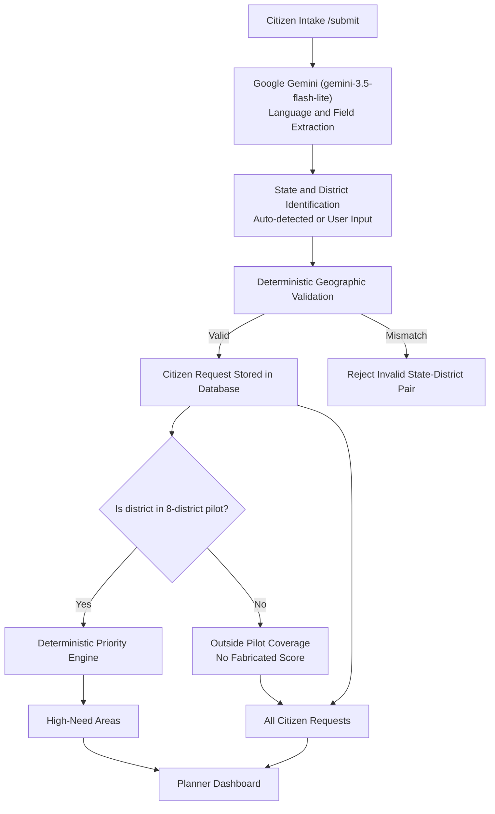

# JanSanket (जनसंकेत)
> **AI-Powered Digital Public Good for Transparent Infrastructure Planning Intelligence**

JanSanket converts unstructured multilingual citizen development requests into normalized district-level demand signals and explainable infrastructure-planning priority evidence.

---

## The Problem
State and national infrastructure planning teams across India struggle to consolidate fragmented citizen requests arriving via diverse linguistic regions and formats. Existing grievance portals (like CPGRAMS) log individual tickets for dispute resolution, but planning departments lack an aggregated demand signal to compare citizen needs against baseline infrastructure deficits and committed investments.

## What the MVP Actually Does
1. **Multilingual Citizen Intake (`/submit`):** Accepts citizen requests in English, Hindi, Kannada, Tamil, or any Indian language from **any Indian State or Union Territory** (28 States + 8 UTs) with safe demo presets (*"Try an example"*).
2. **Defensive Input Screening:** Rejects meaningless text, casual chat, and keyboard mashing (e.g. `sdgsafdasafd`, `hello there`) with HTTP 400 (*"Please describe a real infrastructure or public-service problem."*).
3. **Clean Citizen Intake UX:** Direct, citizen-centric intake without technical AI pipeline explanations. Automatically extracts or prompts for state and district, normalizes aliases deterministically (e.g. Bangalore $\rightarrow$ Bengaluru Urban), and strictly validates state-district pairs without spending LLM tokens on static geography.
4. **Architectural Separation (Intake vs Analytics):**
   - **Citizen Intake:** India-wide. A citizen from any valid district can submit a verified complaint.
   - **Planning Analytics:** Scoped to 8 pilot districts across 4 states with baseline infrastructure context (`demo_synthetic`).
   - Requests from outside pilot districts are stored faithfully as *"Outside Pilot Coverage"*, never assigned fabricated priority scores, and never mixed into the scored hotspot ranking.
5. **Deterministic Priority Scoring:** Pure TypeScript logic computes transparent priority scores ($0.40 \times \text{Demand} + 0.30 \times \text{Need} + 0.15 \times \text{People Affected} + 0.15 \times \text{Unaddressed Need}$) for pilot districts.
6. **Comprehensive Planner Dashboard (`/dashboard`):**
   - **High-Need Areas:** Ranked hotspot table and interactive **"Why this area is highlighted"** breakdown for monitored pilot districts.
   - **All Citizen Requests:** Complete, horizontally-scrollable log of all recorded citizen requests (~52+ seed requests + new submissions) with real-time pilot coverage status badges (*In Pilot Coverage* vs *Outside Pilot Coverage*).

---

## Architectural Data Flow



### Responsibility Boundary
| Component | Responsibility |
| :--- | :--- |
| **Google Gemini (gemini-3.5-flash-lite)** | Unstructured language understanding $\rightarrow$ structured field extraction (`language`, `district`, `category`, `need_summary`, `severity`, `confidence`). |
| **Application Logic** | Input screening, strict schema validation, canonical district mapping, database persistence, and **deterministic priority calculation**. |
| **Strict Boundary Rule** | **AI NEVER calculates priority scores, allocates budgets, or approves projects.** |

---

## Tech Stack
- **Framework:** Next.js 16.3.6 (App Router, Turbopack)
- **Language:** TypeScript 5 (Strict Mode)
- **Styling:** Tailwind CSS v4, Inter Typography (`next/font/google`), Civic design tokens
- **UI Components:** shadcn/ui primitives (`Button`, `Card`, `Badge`, `Textarea`, `Alert`, `Table`)
- **AI Integration:** Google Gemini API (`gemini-3.5-flash-lite`) via server-side REST integration with structured JSON output
- **Database:** Supabase Postgres (via PostgREST HTTP queries) with active fallback storage for local demonstration
- **Deployment:** Vercel

---

## Getting Started Locally

### Prerequisites
- Node.js 18.18+ (tested on Node v20 and v24)
- Google Gemini API Key ([Get one at Google AI Studio](https://aistudio.google.com/app/apikey))

### 1. Clone & Install
```bash
cd code-for-communities
npm install
```

### 2. Configure Environment
Create a `.env.local` file:
```bash
cp .env.example .env.local
```
Edit `.env.local`:
```env
# Google Gemini AI Configuration (Server Only — Never exposed to browser)
GEMINI_API_KEY=your_gemini_api_key_here
GEMINI_MODEL=gemini-3.5-flash-lite

# Optional: Supabase Postgres (If omitted, app runs smoothly in active demo store mode)
NEXT_PUBLIC_SUPABASE_URL=https://your-project.supabase.co
NEXT_PUBLIC_SUPABASE_ANON_KEY=your_supabase_anon_key
SUPABASE_SERVICE_ROLE_KEY=your_service_role_key

# Mode Configuration
DEMO_MODE=true
```

### 3. Run Development Server
```bash
npm run dev
```
Open [http://localhost:3000](http://localhost:3000). The root URL redirects directly to `/dashboard`.

---

## Running Verification & Smoke Tests

JanSanket includes automated end-to-end verification suites covering all 7 correctness and stability priorities:

```bash
# 1. Typecheck and Lint
npm run lint
npm run typecheck

# 2. Production Build
npm run build

# 3. Comprehensive End-to-End Production Smoke Test (9/9 Passed)
npx tsx scripts/smoke-test.ts
```

The automated smoke test verifies:
1. `GET /api/dashboard` loads planning signals and seed data.
2. `POST /api/requests` (action: analyze) processes multilingual Indic scripts.
3. Schema validation guards reject malformed requests with HTTP 422.
4. Request persistence dynamically recalculates total requests and hotspot priority scores.
5. Zero secrets (`GEMINI_API_KEY`, Supabase keys) exposed in HTTP response bodies.
6. Meaningless and non-civic input (`sdgsafdasafd`, `hello there how are you`, `this is a test`, `I like apples`) is screened and rejected with HTTP 400.
7. Outside-scope locations (`Goa / Anjuna`) are never converted to Ramanagara and rejected on submit.
8. State-district mismatches (`Goa + Ramanagara`) are rejected with HTTP 422.
9. Indic requests produce genuine English normalized summaries (never copying raw Indic script into English fields).

---

## 60-Second Demo Walkthrough

1. **Dashboard Overview (0–8s):** Open `/dashboard`. Observe 52+ seeded requests across 8 pilot districts. Point out Rank #1 hotspot: **Ramanagara Roads** with priority score **79.7**.
2. **Citizen Submission (8–20s):** Click **"Submit Request"**. In the **"Try an example"** section, click **"ಕನ್ನಡ (Roads - Ramanagara)"**:
   > *“ಮಳೆ ಬಂದಾಗ ನಮ್ಮ ಗ್ರಾಮದ ರಸ್ತೆ ಬಳಸಲು ಸಾಧ್ಯವಾಗುವುದಿಲ್ಲ, ರಾಮನಗರ ಜಿಲ್ಲೆಯ ಶಾಲೆಗೆ ಹೋಗಲು ಕಷ್ಟವಾಗುತ್ತಿದೆ.”*
3. **AI Normalization (20–32s):** Click **"Analyze Request"**. Observe that Kannada was translated into a concise English need summary, category set to Roads, and location resolved to Ramanagara, Karnataka.
4. **Validation & Confirmation (32–42s):** Acknowledge the demo submission checkbox and click **"Confirm & Submit Request"**. A unique UUID is assigned and persisted. Click **"View Planning Signals"**.
5. **Explain the Hotspot & Complete Visibility (42–60s):** On `/dashboard`, observe that **Ramanagara Roads** has updated dynamically (score jumps to **83.3**). Click the row to inspect **"Why This Area Needs Attention"**:
   $$0.40(100) + 0.30(78.0) + 0.15(72.0) + 0.15(60.8) = \mathbf{83.3}$$
   Scroll down to **"All Citizen Requests"** to show the complete transparent log of all 52+ requests with pilot coverage badges (*In Pilot Coverage* vs *Outside Pilot Coverage*).

---

## Project Structure
```text
code-for-communities/
├── app/
│   ├── page.tsx                     # Redirects to /dashboard
│   ├── layout.tsx                   # Global layout with Inter font & navigation
│   ├── dashboard/page.tsx           # Planner dashboard page
│   ├── submit/page.tsx              # Citizen intake page
│   └── api/
│       ├── requests/route.ts        # POST: analyze (Google Gemini) & submit (persistence)
│       └── dashboard/route.ts       # GET: aggregated planning signals, KPIs & all requests
├── components/
│   ├── dashboard-view.tsx           # Interactive dashboard, KPI cards, hotspot detail & All Requests table
│   ├── request-form.tsx             # Multilingual form with India-wide location selectors & Try-an-example presets
│   ├── navigation.tsx               # Top header with demo_synthetic badge
│   └── ui/                          # shadcn primitives (button, card, alert, table)
├── lib/
│   ├── ai.ts                        # Server-side Google Gemini client + manual fallback
│   ├── india-locations.ts           # 28 States, 8 UTs, static district validation & aliases
│   ├── validation.ts                # Meaningfulness screening, schema & geographic validation
│   ├── priority.ts                  # Deterministic priority formula & project mapping
│   ├── db.ts                        # Supabase PostgREST client & demo store fallback
│   └── demo-data.ts                 # 48 district context rows & 52 citizen requests
├── scripts/
│   ├── smoke-test.ts                # End-to-end production smoke test (11/11 checks)
│   ├── test-ai-provider.ts          # AI extraction & geographic validation test suite
│   ├── verify-ux-data-scope.ts      # UX + Data-scope verification script
│   └── seed-pilot-data.ts           # Database seed script
├── supabase/
│   ├── migrations/                  # Schema, RLS policies, and seed migrations
│   └── seed.sql                     # Combined seed script
└── docs/
    ├── 00_problem.md                # Problem definition & user persona
    ├── 01_prd.md                    # Product requirements & boundary rules
    ├── 02_architecture.md           # Architecture design & formula specification
    ├── 03_design.md                 # Design tokens & UI specifications
    ├── 04_implementation_plan.md   # Implementation plan (M0–M5 + Stabilization)
    ├── 05_demo_and_pitch.md         # Demo pitch script & slide deck outline
    └── DEMO_CHEATSHEET.md           # 60s demo cheatsheet & judge defense Q&A
```

---

## Disclaimers & Known Limitations
- **`demo_synthetic` Baseline:** District baseline metrics (population, infrastructure need index, investment coverage) are realistic simulated proxies structured after open government data formats (data.gov.in, India Investment Grid). They are labeled `demo_synthetic` and must not be used as official government statistics.
- **National Intake vs. Pilot Analytics:** Citizen intake accepts and validates complaints from **any of India's 28 States and 8 Union Territories**. Scored planning analytics and hotspot rankings are currently restricted to the 8 pilot districts where baseline context exists. Non-pilot submissions are stored safely as *"Outside Pilot Coverage"* without fabricated metrics.
- **Decision Support Only:** JanSanket does not automatically disburse public funds, approve projects, or replace administrative officers. It is a Digital Public Good planning intelligence prototype.
- **Privacy:** No Aadhaar numbers, phone numbers, personal names, or exact home addresses are collected or stored.
