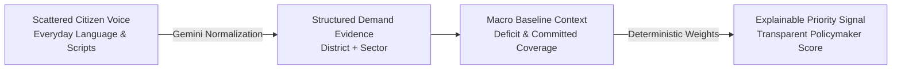

# Problem Definition

## Problem statement

**AI for Digital Public Infrastructure & Governance**
**THEME: INNOVATION**
**THE PROBLEM**
Governments across India struggle to consolidate citizen feedback and align it with national infrastructure priorities. Development requests live in fragmented systems, leading to misaligned public spending, unaddressed infrastructure gaps, and no way to measure the impact of large-scale digital public infrastructure initiatives.

**THE CHALLENGE**
Build a scalable, multilingual AI platform — designed as a Digital Public Good — that aggregates citizen development requests via voice, text, and messaging apps across diverse linguistic regions of India. The system should analyse large datasets combining citizen feedback with national demographic data, infrastructure indices, and public investment plans, surfacing demand hotspots and recommending high-priority development projects to national policymakers.

## One specific user

A **state infrastructure-planning analyst preparing a district-level development shortlist** for the next planning cycle.

The product is designed so the same workflow can aggregate across states and feed national planning teams later; the MVP deliberately starts with a small, representative dataset so a solo builder can prove the workflow.

## Actual pain

**Planning teams do not have a normalized district-level demand signal that can be compared with infrastructure gaps and existing investment coverage.**

## Reality check: who already does parts of this?

- **CPGRAMS** already provides nationwide grievance submission, tracking and appeals; its current portal also advertises a voice-based grievance utility and support across 22 Eighth Schedule languages. That means a voice-enabled grievance intake screen is not, by itself, a defensible differentiator. [CPGRAMS](https://pgportal.gov.in/) 
- **MyGov** already provides a national citizen-engagement channel for suggestions, discussion and feedback. [MyGov](https://www.mygov.in/)
- Kerala's government **Citizen Response Programme** is an existing example of infrastructure feedback collection with geolocation, classification and a dashboard. It is useful evidence that the collection layer is feasible, but it is state-specific rather than a national cross-context planning layer. [Citizen Response Programme](https://play.google.com/store/apps/details?id=in.gov.kerala.prd.crp)
- **India Investment Grid / National Infrastructure Pipeline** already exposes national infrastructure investment/project information. The opportunity is not to recreate an investment catalogue; it is to connect demand signals to infrastructure-gap context and existing investment coverage. [IIG](https://indiainvestmentgrid.gov.in/) [NIP overview](https://indiainvestmentgrid.gov.in/index.jsp)

### The gap

The defensible MVP gap is **decision support between citizen voice and infrastructure planning**:

> **Raw citizen signals → normalized issue + location → district-level demand aggregation → infrastructure/investment context → transparent priority signal.**

This is materially different from simply filing or routing a grievance. The product should not promise to replace CPGRAMS, MyGov, planning departments, or government officers.

### What makes this distinct

1. **Demand is aggregated, not just logged.** Similar requests become district/category demand signals.
2. **Demand is contextualized.** A hotspot is shown beside infrastructure-gap and planned-investment coverage indicators.
3. **The score is explainable.** Each priority signal shows its components and source status instead of asking policymakers to trust an opaque AI ranking.

## Judging criteria and how the project addresses each

| Judging criterion | MVP response |
|---|---|
| Functioning end-to-end flow | Citizen submits multilingual text request → Gemini extracts structured request → request is stored → dashboard recalculates hotspot and priority signal. |
| Mandatory Google AI integration | Gemini API (`gemini-3.8-flash`) performs multilingual request normalization. Gemini structured output is used so the response conforms to the application's schema. |
| Real or realistic data | 52 realistic synthetic citizen requests across 8 Indian districts in 4 states, plus 48 realistic district-context records. The UI explicitly labels the demo dataset as `demo_synthetic`; the schema is designed around public Indian datasets (OGD, IIG). |
| Built for India | Data model is state/district based, supports Indian languages (English, Hindi, Kannada, Tamil), and uses national-style infrastructure and investment context rather than one-city assumptions. |
| Multilingual support | Multilingual text intake is the guaranteed path with 1-click test presets for English, Hindi, Kannada, and Tamil. Voice was evaluated during viability testing and cut to ensure a zero-latency, barrier-free demonstration without browser microphone permission hazards. |
| Deployable prototype | Next.js on Vercel with Supabase and server-side Gemini calls; no required live government API dependency. |

## Data reality

Do **not** pretend the seed data are official government statistics. The hackathon permits realistic sample data. The MVP uses realistic synthetic values with explicit `demo_synthetic` provenance labels. The production path would ingest official district-level datasets from the Government of India's Open Government Data platform and investment/project sources.

Useful official data-source candidates include:

- [Open Government Data Platform India](https://data.gov.in/)
- [District Level Household and Facility Survey indicators](https://punjab.data.gov.in/catalog/key-indicators-district-level-household-and-facility-survey)
- [UDISE+ district education infrastructure examples](https://jk.data.gov.in/resource/district-wise-percentage-educational-infrastructure-government-schools-uttar-pradesh-udise)
- [District-level rural health statistics](https://data.gov.in/catalog/rural-health-statistics-2017)
- [India Investment Grid / National Infrastructure Pipeline](https://indiainvestmentgrid.gov.in/index.jsp)

These sources are **reference/data-source candidates for the MVP**, not runtime dependencies.

## Success = the 60-second demo shows ...

**a citizen submitting a request in an Indian language (e.g. English, Kannada, Hindi, or Tamil) → Gemini returns the detected language, district, issue category, need summary, and severity → the request is validated and saved → the district/category demand signal and priority score visibly update on the policymaker dashboard → the score can be explained using demand intensity, baseline infrastructure gap, population impact, and unaddressed investment coverage.**

## Core product boundary

JanSanket is a **planning intelligence prototype**, not a grievance-redressal portal, not an automated public-spending system, and not a government decision-maker. The human planner remains responsible for the final decision.
