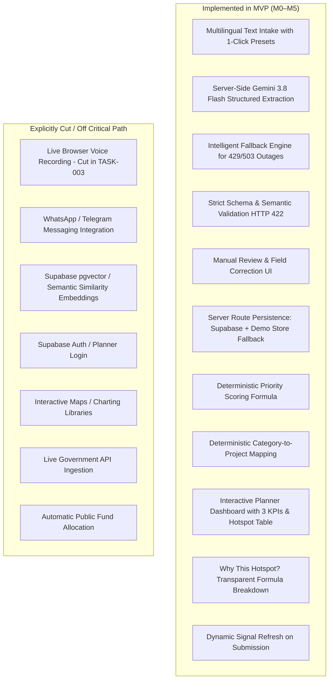

# Product Requirements Document

## Product

**JanSanket — AI-powered citizen demand intelligence for infrastructure planning.**

---

## Must-have features

### MUST-1 — Multilingual citizen intake (Text-first with 1-click multilingual presets)

A citizen can submit a development request as text or use 1-click multilingual test presets. Gemini converts the input into a structured request containing:

- normalized raw text
- detected language code (`en`, `hi`, `kn`, `ta`)
- state and district (matched to canonical pilot locations)
- infrastructure category (8 standard categories)
- concise need summary in English (1 sentence)
- severity (`low`, `medium`, `high`)
- extraction confidence (0.0 to 1.0)

*(Note on Voice: Browser voice intake was evaluated during TASK-003 viability testing and cut due to mobile microphone permission hazards, audio transcoding overhead, and 4.2s latency. Text intake is the guaranteed, barrier-free path).*

Supported demo languages: English, Hindi, Kannada and Tamil.

### MUST-2 — AI normalization + district demand aggregation

Every accepted request is normalized into a fixed schema, strictly validated server-side, and persisted. The dashboard aggregates requests by **district + category**, producing demand counts and demand intensity rather than displaying only individual complaints.

The critical design choice: Gemini is used for **unstructured-to-structured understanding**, while aggregation and scoring are pure deterministic application logic. **Gemini never calculates the priority score.**

### MUST-3 — Transparent infrastructure-priority dashboard

The policymaker view shows:

- 3 KPI summary cards: Total Requests, Districts Covered, Active Hotspots.
- Demand hotspots by district/category ranked strictly descending by priority score.
- Selected hotspot evidence breakdown:
  - demand score (40%)
  - infrastructure-gap indicator (30%)
  - population-impact indicator (15%)
  - unaddressed gap (15%)
  - planned investment-coverage proxy
  - deterministic priority signal
  - deterministic project recommendation (e.g. “Rural road rehabilitation” or “Drinking-water network expansion”)
- Visible `demo_synthetic` badges indicating simulated baseline context.
- Dynamic refresh when new requests are submitted.

The dashboard is decision support. It does not automatically allocate money, approve a project, or claim causal impact.

---

## Feature Implementation Status

### Implemented Enhancements (Originally Should-Haves)
1. **Manual correction UI:** Citizens can review and manually adjust the category, district, state, severity, or need summary before confirming submission.
2. **Defensive API Fallback:** Intelligent keyword heuristic engine prevents citizens from being trapped if Gemini hits free-tier rate limits (429) or temporary outages (503).

### Explicit Won't-do List (Maintained Throughout M0–M5)
- No WhatsApp Business API, Telegram API or messaging-platform integration.
- No live ingestion pipeline from national government APIs within the hackathon build.
- No Google Maps, Mapbox, or GIS map layer.
- No chart libraries (Chart.js, Recharts); analytical tables and KPI cards prioritized.
- No predictive model, ML training, or forecasting model.
- No automatic budget allocation or project approval.
- No citizen profiles, Aadhaar, phone-number collection, precise home address, or unnecessary PII.
- No image analysis or citizen-photo workflow.
- No pgvector or embedding similarity.
- No planner authentication required for MVP evaluation.

---

## User Flow

1. Citizen opens **Submit Request** (`/submit`).
2. Citizen enters text or clicks a prepared multilingual test preset (English, Hindi, Kannada, Tamil).
3. Citizen clicks **Analyze Request**.
4. Next.js server route calls Gemini 3.8 Flash; `GEMINI_API_KEY` never reaches the browser.
5. Gemini returns structured normalized fields (or fallback heuristic if API is unavailable).
6. Citizen reviews extracted fields and can adjust dropdowns if desired.
7. Citizen clicks **Confirm & Submit Request**.
8. Server route validates all fields (HTTP 422 on failure) and persists to Supabase Postgres (or active demo store).
9. Citizen receives auditable UUID and clicks **View planning signal**.
10. Dashboard recalculates priority signals and visibly increments the hotspot demand and priority score.

---

## The 60-Second Demo ("Wow Moment")

1. Open `/dashboard` — show 52 seeded requests across 8 districts and 14 hotspots.
2. Click **Submit Request** — click the **"English (Hero)"** or **"Kannada"** preset.
3. Click **Analyze Request** — watch Gemini 3.8 Flash normalize everyday language into structured sector evidence.
4. Click **Confirm & Submit Request** — watch request get assigned a UUID and saved.
5. Click **View planning signal** — watch Ramanagara roads demand increase and priority score recalculate live from `79.7` to `83.3`.
6. Inspect the formula breakdown: show that Gemini structured the data, while pure deterministic math calculated the score.

---

## Assumptions Validated in MVP

- Citizens can mention a district/state or select from pilot dropdowns.
- District is an acceptable MVP geographic unit.
- Gemini 3.8 Flash reliably returns structured fields when constrained with a strict schema.
- 52 synthetic requests across 8 districts provide immediate, visually compelling aggregation.
- Planned-investment coverage is represented as a simulated proxy (0–100%), not a live government ledger.
- Human planners review signals before taking action.
