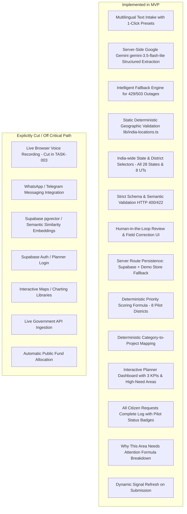

# Product Requirements Document

## Product

**JanSanket — AI-powered citizen demand intelligence for infrastructure planning.**

---

## Must-have features

### MUST-1 — Multilingual citizen intake (India-Wide, Text-first with 1-click multilingual presets)

A citizen can submit a development request from **any Indian State or Union Territory (28 States + 8 UTs)** as text or use 1-click multilingual test presets. Google Gemini (`gemini-3.5-flash-lite`) converts the input into a structured request containing:

- normalized raw text
- detected language code (`en`, `hi`, `kn`, `ta`, etc.)
- state and district (extracted or prompted from citizen; normalized against static geographic registry)
- infrastructure category (8 standard categories)
- concise need summary in English (1 sentence)
- severity (`low`, `medium`, `high`)
- extraction confidence (0.0 to 1.0)

*(Note on Voice: Browser voice intake was evaluated during TASK-003 viability testing and cut due to mobile microphone permission hazards, audio transcoding overhead, and 4.2s latency. Text intake is the guaranteed, barrier-free path).*

Supported demo languages: English, Hindi, Kannada, Tamil, and any Indic language.

### MUST-2 — AI normalization + district demand aggregation
Every accepted request is normalized into a fixed schema, strictly validated server-side, and persisted. 

- **Intake Scope:** India-wide (all 28 States & 8 UTs).
- **Planning Scope:** Requests belonging to the 8 pilot districts are aggregated into hotspot demand signals with baseline context (`demo_synthetic`).
- **Outside Pilot Scope:** Requests outside the 8 pilot districts are stored faithfully as *"Outside Pilot Coverage"*, avoiding fabricated context metrics or fake priority scores.

The critical design choice: AI is used for **unstructured-to-structured understanding**, while aggregation and scoring are pure deterministic application logic. **AI never calculates the priority score.**

### MUST-3 — Transparent infrastructure-priority dashboard
The policymaker view shows:

- 3 KPI summary cards: Citizen Demand, Districts Monitored (8 pilot districts), High-Need Areas.
- Demand hotspots by district/category ranked strictly descending by priority score for pilot districts.
- Selected hotspot evidence breakdown:
  - demand score (40%)
  - infrastructure-gap indicator (30%)
  - population-impact indicator (15%)
  - unaddressed gap (15%)
  - planned investment-coverage proxy
  - deterministic priority signal
  - deterministic project recommendation
- **All Citizen Requests Table:** Complete, horizontally-scrollable log of all recorded citizen requests (~52+ seed requests + new submissions) with pilot coverage status badges (*In Pilot Coverage* vs *Outside Pilot Coverage*).
- Visible `demo_synthetic` badges indicating simulated baseline context.
- Dynamic refresh when new requests are submitted.

The dashboard is decision support. It does not automatically allocate money, approve a project, or claim causal impact.

---

## Feature Implementation Status

### Implemented Enhancements
1. **Manual correction UI:** Citizens can review and manually adjust the category, district, state, severity, or need summary before confirming submission.
2. **Defensive API Fallback:** Intelligent keyword heuristic engine prevents citizens from being trapped if the AI provider hits rate limits (429) or temporary outages (503).
3. **India-Wide Geographic Validation:** Static 28-state + 8-UT dataset with aliases validates state-district pairs deterministically without wasting AI tokens.

### Explicit Won't-do List
- No WhatsApp Business API, Telegram API or messaging-platform integration.
- No live ingestion pipeline from national government APIs within the hackathon build.
- No Google Maps, Mapbox, or GIS map layer.
- No chart libraries (Chart.js, Recharts); analytical tables and KPI cards prioritized.
- No predictive model, ML training, or forecasting model.
- No automatic budget allocation or project approval.
- No citizen profiles, Aadhaar, phone-number collection, precise home address, or unnecessary PII.
- No image analysis or citizen-photo workflow.
- No pgvector or embedding similarity.
- No planner authentication required for MVP evaluation.

---

## User Flow

1. Citizen opens **Submit Request** (`/submit`).
2. Citizen enters text or clicks a prepared multilingual test preset (English, Hindi, Kannada, Tamil).
3. Citizen clicks **Analyze Request**.
4. Next.js server route calls Google Gemini (`gemini-3.5-flash-lite`); server keys never reach the browser.
5. AI extracts structured fields (or fallback heuristic if provider is unavailable).
6. Citizen reviews extracted fields, adjusts State/District dropdowns if desired (covering all 28 States and 8 UTs).
7. System deterministically validates that District belongs to State. If district is missing, citizen is prompted to provide it (never defaulted to Ramanagara).
8. Citizen clicks **Confirm & Submit Request**.
9. Server route validates all fields (HTTP 422 on mismatch) and persists to Supabase Postgres (or active demo store).
10. Citizen receives auditable UUID and clicks **View planning signals**.
11. Dashboard renders the High-Need Areas for pilot districts and includes the new submission in the **All Citizen Requests** log.

---

## Assumptions Validated in MVP

- Citizens can mention a district/state or select from India-wide state and district dropdowns.
- District is an acceptable MVP geographic unit.
- Google Gemini (gemini-3.5-flash-lite) reliably returns structured fields when constrained with a strict schema.
- 52 synthetic requests across 8 pilot districts provide immediate, visually compelling planning aggregation.
- Requests outside the pilot districts are stored faithfully without fabricated scores.
- Planned-investment coverage is represented as a simulated proxy (0–100%), not a live government ledger.
- Human planners review signals before taking action.
