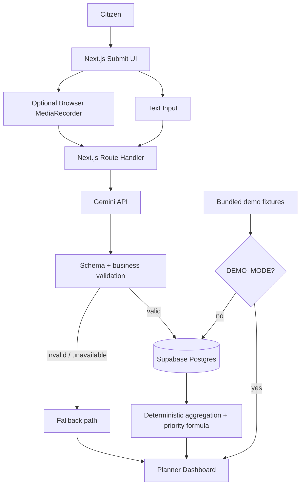

# Architecture

## Stack

| Layer | Choice | MVP use |
|---|---|---|
| Web app | Next.js App Router + TypeScript | UI, server routes, deployment in one codebase. |
| UI | shadcn/ui + Tailwind CSS | Fast, consistent UI without a custom design system. |
| Database | Supabase Postgres | Requests and district/category context. |
| Authentication | Supabase Auth | Fixed-stack capability, **not implemented in MVP**. |
| File storage | Supabase Storage | Fixed-stack capability, **not used for raw audio in MVP**. |
| Vectors | Supabase pgvector | Fixed-stack capability, **not used in MVP**. |
| AI | Gemini API via `@google/genai` | Required Google AI integration for text/audio normalization and structured output. |
| Deployment | Vercel | Next.js deployment. |
| Backend | Next.js Route Handlers | Avoids a second Python deployment because no Python-specific workload is required. |
| Python/FastAPI | None | Only reconsider if a proven blocker appears. |

The MVP uses the fixed stack without adding libraries. The key simplification is **not using every Supabase capability** just because it is available.

## System/component/data-flow diagram



## Folder structure

```text
/
├── app/
│   ├── page.tsx
│   ├── dashboard/page.tsx
│   ├── submit/page.tsx
│   └── api/
│       ├── requests/route.ts
│       ├── requests/voice/route.ts      # optional if voice survives test
│       └── dashboard/route.ts
├── components/
│   ├── request-form.tsx
│   ├── voice-recorder.tsx               # optional if voice survives test
│   ├── priority-card.tsx
│   ├── hotspot-table.tsx
│   └── navigation.tsx
├── lib/
│   ├── gemini.ts
│   ├── priority.ts
│   ├── validation.ts
│   ├── demo-data.ts
│   └── supabase/
│       ├── client.ts
│       └── server.ts
├── supabase/
│   └── migrations/
├── public/
└── docs/
```

## Architecture rules

1. **Gemini is server-side only.** Never expose `GEMINI_API_KEY` to the browser.
2. **AI interprets; deterministic code calculates.** Gemini must not decide the priority score or budget.
3. **No unnecessary PII.** Store only the data needed to demonstrate planning intelligence.
4. **Raw voice is transient.** Do not persist the uploaded audio in the MVP.
5. **Validate every AI field.** Schema-valid JSON is necessary but not sufficient.
6. **Use one canonical district reference.** The valid district/state combinations come from the seeded `district_context` rows.
7. **Demo data is explicitly labelled.** Synthetic values must never be presented as official statistics.
8. **No live government API is on the critical path.** A public source failure must not kill the demo.
9. **Dashboard must work before any new request is submitted.** Seed fixtures guarantee this.
10. **Browser does not write directly to Supabase.** Next.js server routes own persistence.
11. **Service-role keys, if used, stay server-side.** Prefer the least-privileged server connection that works.
12. **Do not store chain-of-thought.** Store only concise rationale/evidence fields intended for users.
13. **Demo mode must use the same dashboard components.** It is a fallback data source, not a separate fake UI.

## Data model

### `citizen_requests`

| Field | Type | Notes |
|---|---|---|
| `id` | uuid | Primary key. |
| `source` | text | `text`, `voice`, or `manual_fallback`. |
| `raw_text` | text | Original user text or Gemini transcript. |
| `language_code` | text | ISO-like short code such as `en`, `hi`, `kn`, `ta`. |
| `state` | text | Normalized state/UT. |
| `district` | text | Normalized district. |
| `category` | text | `roads`, `water`, `sanitation`, `healthcare`, `education`, `power`, `transport`, `other`. |
| `need_summary` | text | One-sentence normalized need. |
| `severity` | text | `low`, `medium`, or `high`. |
| `ai_confidence` | numeric | 0–1. |
| `created_at` | timestamptz | Submission timestamp. |

### `district_context`

Each row is a **state + district + category** context record. This avoids comparing, for example, road demand with generic district-wide infrastructure data.

| Field | Type | Notes |
|---|---|---|
| `id` | uuid | Primary key. |
| `state` | text | State/UT. |
| `district` | text | District. |
| `category` | text | Same controlled category set as `citizen_requests`. |
| `population` | integer | Synthetic demo population proxy. |
| `infrastructure_gap_index` | numeric | 0–100; higher means larger demo gap. |
| `planned_coverage_pct` | numeric | 0–100; **demo investment-coverage proxy**. |
| `population_impact_score` | numeric | 0–100 demo-normalized impact proxy. |
| `source_status` | text | `demo_synthetic`. |
| `source_url` | text | Public source family/reference URL. |
| `updated_at` | timestamptz | Context timestamp. |

**No `profiles` table and no `embedding vector(...)` column are required for the MVP.**

## Priority formula

For each state/district/category combination:

```text
requests_per_100k =
    (request_count / population) * 100000

 demand_score =
    min(100, requests_per_100k * 5)

unaddressed_gap =
    infrastructure_gap_index *
    (1 - planned_coverage_pct / 100)

priority_score =
    0.40 * demand_score
  + 0.30 * infrastructure_gap_index
  + 0.15 * population_impact_score
  + 0.15 * unaddressed_gap
```

The coefficients are **demo policy weights**, not an objective measure of public value. In production they would require domain review and governance.

The project recommendation is **not generated by a second AI call**. It is a deterministic category mapping:

```text
roads      -> Rural road rehabilitation
water      -> Drinking-water network expansion
sanitation -> Community sanitation infrastructure
healthcare -> Primary healthcare access upgrade
education  -> School infrastructure upgrade
power      -> Rural power distribution upgrade
transport  -> Local public-transport access upgrade
other      -> Further planning review required
```

## API endpoints

### `POST /api/requests`

**Input**

```json
{
  "source": "text",
  "rawText": "The road connecting our village to the main road becomes unusable during monsoon.",
  "stateHint": "Karnataka",
  "districtHint": "Ramanagara"
}
```

**Output**

```json
{
  "request": {
    "id": "uuid",
    "language_code": "en",
    "state": "Karnataka",
    "district": "Ramanagara",
    "category": "roads",
    "need_summary": "Improve the village-to-main-road connection for monsoon access.",
    "severity": "high",
    "ai_confidence": 0.94
  }
}
```

### `POST /api/requests/voice`

**Input:** multipart `audio` with a short supported recording, plus optional state/district hints.

**Output:** normalized request schema plus transcript.

This endpoint is optional. It is created only if the viability test succeeds.

### `GET /api/dashboard`

**Input:** optional `state` and `category` query parameters are allowed by the route contract, but filters are not an MVP UI requirement.

**Output**

```json
{
  "summary": {
    "total_requests": 50,
    "districts": 8,
    "hotspots": 4
  },
  "hotspots": [
    {
      "state": "Karnataka",
      "district": "Ramanagara",
      "category": "roads",
      "request_count": 9,
      "demand_score": 81,
      "infrastructure_gap_index": 72,
      "population_impact_score": 65,
      "planned_coverage_pct": 25,
      "unaddressed_gap": 54,
      "priority_score": 73.8,
      "recommended_project": "Rural road rehabilitation",
      "source_status": "demo_synthetic"
    }
  ]
}
```

### `GET /api/health`

**Output:** `{ "ok": true }` with safe dependency status only. Never expose secrets or stack traces.

## AI pipeline: input → prompt → model → output validation → fallback

### Text

`raw text + optional hints`
→ Gemini structured extraction
→ `gemini-3.8-flash`
→ schema validation
→ semantic validation against known district/category values
→ normalized request
→ Postgres persistence

Gemini 3.8 Flash is the configured model for the MVP. Verify the current Gemini model documentation before deployment if the model identifier or capabilities change.

### Voice

`browser-supported short recording`
→ MIME/size/duration guard
→ Gemini audio understanding
→ structured response containing transcript + fields
→ validation
→ persistence

### Prompt contract

The model is instructed to:

- extract rather than invent;
- return only the required schema;
- map to one allowed infrastructure category;
- identify language;
- normalize state/district names;
- return uncertainty instead of inventing a location;
- produce a concise need summary;
- never decide budget, approval, or public-spending allocation.

### Validation

Reject or route to fallback when:

- JSON is invalid;
- category is outside the allow-list;
- confidence is outside 0–1;
- district/state combination is unknown;
- required strings are empty;
- model response is otherwise unusable.

### Fallback hierarchy

1. **AI unavailable but app available:** let the user use a minimal manual category + district path if already implemented; otherwise show the prepared text request and continue the demo.
2. **Voice unavailable:** switch to text.
3. **Supabase unavailable:** dashboard switches to bundled `demo-data.ts` fixtures when `DEMO_MODE=true`; new-request persistence failure is shown clearly.
4. **Internet/API outage:** use local demo fixtures and the recorded demo.
5. **Live demo instability:** stop debugging in front of judges and use the recorded 60-second walkthrough.

## DEMO_MODE

Use:

```text
DEMO_MODE=false
```

Normal mode reads and writes Supabase.

When `DEMO_MODE=true`, the dashboard uses the same aggregation/display components with bundled, prevalidated seed fixtures. This is not a separate mock UI.

A prepared fallback request can also be used when Gemini is unavailable so the dashboard portion of the demo remains demonstrable.

## External dependencies and failure behavior

| Dependency | Purpose | Failure behavior |
|---|---|---|
| Gemini API | Text/audio normalization | Text can fall back to manual/prepared input; dashboard still works from seeded data. |
| Supabase Postgres | Persistence/context | Use bundled demo fixtures for dashboard; show save failure for new submissions. |
| Browser microphone | Optional voice | Fall back to text immediately. |
| Vercel | Deployment | Use local build and recorded demo while restoring deployment. |
| Official OGD/IIG sources | Future data ingestion | No runtime effect in MVP. |
| Supabase Auth | Future planner access | No effect in MVP because authentication is not required. |
| Supabase Storage | Future governed file storage | No effect because raw audio is not stored. |
| pgvector | Future semantic similarity | No effect because MVP does not use embeddings. |

## Riskiest assumption

**Gemini can reliably normalize short Indian-language citizen requests into the required district/category schema quickly enough for the demo.**

## Fastest practical test for that assumption

Spend **20 minutes before implementing the dashboard**:

- test 5 multilingual text requests first;
- if voice is desired, test 3 short recordings in browsers you can actually use;
- check district, category, language, concise summary, and response time.

**Pass:** the structured results are consistently usable.

**Kill voice:** browser/audio handling or transcription is unstable. Keep multilingual text.

## Environment variables

```text
NEXT_PUBLIC_SUPABASE_URL=
NEXT_PUBLIC_SUPABASE_ANON_KEY=
SUPABASE_SERVICE_ROLE_KEY=   # server only if actually required
GEMINI_API_KEY=              # server only
GEMINI_MODEL=gemini-3.8-flash
NEXT_PUBLIC_APP_URL=
DEMO_MODE=false
```

## Decisions log

| ID | Decision | Why |
|---|---|---|
| D001 | Next.js Route Handlers instead of FastAPI | One deployment and no Python-specific workload. |
| D002 | Text is the guaranteed intake path | Lowest technical risk in a 12-hour solo build. |
| D003 | Voice is optional after a viability test | Browser audio is the highest-risk UI/API path. |
| D004 | Gemini structured output | Makes extraction predictable and easy to validate. |
| D005 | Deterministic priority formula | Transparent and testable; avoids pretending the LLM is the policy decision-maker. |
| D006 | Context key is state + district + category | Prevents comparing one infrastructure category to unrelated district context. |
| D007 | ~50 synthetic requests across 8 districts | Enough visual signal without spending hours hand-authoring data. |
| D008 | Demo investment coverage is a proxy | The MVP has no live project ledger and must not imply otherwise. |
| D009 | No embeddings/pgvector | Not needed for the aggregation use case. |
| D010 | No authentication | Not required to prove the judging flow; removes a deployment failure mode. |
| D011 | DEMO_MODE exists from day one | Prevents external service failure from killing the demo. |
| D012 | Project recommendations are category mappings | Avoids a second AI call and keeps recommendations deterministic. |
