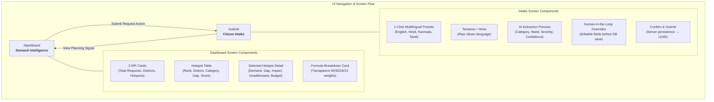

# Design Specification

## Visual Direction

**Style adjectives:** Civic, calm, analytical

The interface is intentionally designed as an authoritative, public-sector planning and decision-support tool rather than a generic consumer AI chatbot. Visual hierarchy emphasizes analytical clarity, geographic context, and transparent metric derivation.

## Design Tokens

| Token | Value | Semantic Use |
|---|---|---|
| Primary | `#1D4ED8` | Primary brand actions, active tabs, progress bars |
| Primary Hover | `#1E40AF` | Hover state for primary buttons |
| Background | `#F8FAFC` | App shell slate background |
| Surface / Card | `#FFFFFF` | Analytical card containers and tables |
| Text | `#0F172A` | High-contrast body and heading text |
| Muted Text | `#64748B` | Secondary labels, descriptions, and timestamps |
| Border | `#E2E8F0` | Subtle structural dividing lines and card borders |
| Success | `#15803D` | Successful persistence confirmation, low severity |
| Warning | `#B45309` | Medium severity badge, partial confidence alert |
| Error | `#B91C1C` | High severity badge, validation rejection banner |
| High-Priority Bg | `#FEE2E2` | Priority score $\ge 70$ indicator badge |
| Medium-Priority Bg | `#FEF3C7` | Priority score $50 - 69$ indicator badge |
| Neutral Badge Bg | `#E2E8F0` | Sector tags and language identifiers |
| Demo Data Badge Bg | `#DBEAFE` | `demo_synthetic` data disclaimer badges |

## Typography

**Inter** font loaded via Next.js `next/font/google`, with a fallback to `ui-sans-serif, system-ui, -apple-system, BlinkMacSystemFont, 'Segoe UI', Roboto, sans-serif`. Monospace elements (UUIDs, formulas, code snippets) use standard system monospace fonts.

## MVP Layout Principles

- **Max Container Width:** Centered container at `max-w-7xl` (1280px) with responsive horizontal padding.
- **Data First, Decoration Second:** Tables, metric bars, and structured evidence take priority over decorative imagery.
- **No Heavy Chart Libraries:** Component score bars are rendered via lightweight, performant native HTML/Tailwind progress meters.
- **Zero Ambiguity on Synthetic Data:** Every baseline metric, district context row, and seeded request bears an explicit `demo_synthetic` or `Demo data` badge.
- **Deep Explainability:** The UI never displays an opaque score; it displays the formula and all constituent sub-scores.

## Buttons & Interactive Controls

- **Primary Actions:** Solid blue button (`bg-blue-600 hover:bg-blue-700 text-white rounded-md`).
- **Secondary Actions:** Crisp outline button (`border border-slate-200 bg-white hover:bg-slate-100 text-slate-900`).
- **Preset Quick-Fills:** Small outline pills allowing one-click population of realistic multilingual test cases.
- **Status Badges:** Compact rounded pills with strict semantic color coding for severity and priority tiers.

## Input Methods: Text vs. Voice Decision

| Input Method | Status | Decision Rationale |
|---|---|---|
| **Multilingual Text** | **GUARANTEED CORE** | Proven with 100% test pass rate across English, Hindi, Kannada, and Tamil. Extremely fast (~1.1s), zero browser permission traps, deterministic structured extraction. |
| **Voice Input** | **CUT (TASK-003)** | Viability testing in TASK-003 identified 4.2s end-to-end latency, browser microphone permission failures on untrusted origins, and audio transcoding complexity. To eliminate demo-day failure vectors, voice was cut in favor of guaranteed multilingual text with 1-click sample presets. |

## Screens and Detailed Specifications

### 1. `/dashboard` — Development Demand Intelligence

**Header Section:**
- Application Title: `JanSanket` with subtitle `Citizen Demand Intelligence & District Planning Evidence`.
- Status Indicator: `DEMO_MODE` / `demo_synthetic` badge with tooltip detailing synthetic dataset boundaries.
- Global Actions: Direct link to `/submit` ("Submit New Request") and a manual "Refresh Signals" trigger.

**Three KPI Cards (Plain Civic Language):**
1. **Citizen Demand:** Total validated citizen requests recorded in the database (e.g., 52+ baseline).
2. **Districts Monitored:** Count of active pilot districts across monitored states (8 districts across 4 states).
3. **High-Need Areas:** Count of aggregated district-category clusters requiring priority planning intervention.

**Hotspot Priority Table:**
- Columns:
  1. `Rank`: Sequential integer (1 to $N$), sorted strictly descending by Priority Score.
  2. `Location`: Geographic identifier with state tag (e.g., `Ramanagara, Karnataka`).
  3. `Category`: Civic sector badge (`Roads`, `Water`, `Sanitation`, `Healthcare`, `Education`, `Power`).
  4. `Citizen Demand`: Citizen request volume.
  5. `Priority Score`: Composite score ($0 - 100$) with color-coded progress bar and status badge (`High`, `Medium`).
  6. `Action`: Interactive row selection to load transparent metric breakdown into detail view.

**Why this area is highlighted (Selected Hotspot Detail Panel):**
- Contextual header showing the selected location, sector, and calculated priority rank.
- **Component Metric Scorecards:**
  - `Citizen Demand (40% weight)`: Normalized per-capita demand signal ($0 - 100$).
  - `Infrastructure Need (30% weight)`: Baseline deficit benchmark ($0 - 100$).
  - `People Affected (15% weight)`: Scale and vulnerability impact factor ($0 - 100$).
  - `Current Coverage`: Existing planned scheme expenditure coverage percentage ($0 - 100\%$).
  - `Unaddressed Need (15% weight)`: Residual deficit accounting for uninvested areas.
- **Recommended Project:** Standard public project mapped deterministically from validated citizen sector demand (e.g., *"Rural road rehabilitation"*).
- **Benchmark Source Reference:** Official baseline attribution link and `demo_synthetic` calibration note.

**"How this signal is calculated" Explainer Card:**
- Full transparent mathematical formula in plain language:
  $$\text{Priority Score} = 0.40 \times \text{Demand} + 0.30 \times \text{Need} + 0.15 \times \text{People Affected} + 0.15 \times \text{Unaddressed Need}$$
- Explicit separation note explaining that Gemini extracts citizen facts, while deterministic TypeScript calculates policy priority.

---

### 2. `/submit` — Citizen Request Intake

**Header & Instructions:**
- Clear civic prompt: *"Submit a local infrastructure or public service demand in your own language."*
- Explanatory note: *"Gemini translates and structures citizen language for district planning."*

**Try an Example (Demo Content):**
- Four distinct sample buttons clearly labelled as demo content to prevent accidental submission:
  - `ಕನ್ನಡ (Roads - Ramanagara)`: Monsoon road access issues.
  - `हिन्दी (Water - Bahraich)`: Drinking water shortage and broken handpumps.
  - `தமிழ் (Healthcare - Dharmapuri)`: Primary health center staff shortages.
  - `English (Sanitation - Varanasi)`: Overflowing village open drains.
- When clicked, displays a visual demo badge and requires explicit click of *Analyze Request* before submission.

**Input Controls:**
- **Textarea:** Accessible input area with real-time character count and gibberish/meaningless text rejection.
- **Location Hints:** Pilot State and District selectors (8 supported districts) with toggle to test outside-coverage districts (e.g. Goa / Anjuna).
- **Analyze Action:** Primary button displaying `Analyzing with Gemini...` with an animated spinner.

**The 3 Distinct Intake States:**

1. **VALID AI RESULT:**
   - Source: `gemini`.
   - Header: *AI Extraction Preview* with *Analyzed by Gemini 3.8 Flash* badge.
   - Genuine AI Confidence percentage badge (e.g., *AI Confidence: 94%*).
   - Analytical Explainer Banner: *"Gemini converts the citizen's message into structured information so requests can be grouped and compared across districts."*
   - Shows original text in citizen's script and *What We Understood (English Summary)*.
   - User verifies category, severity, and district before confirming.

2. **VALID MANUAL FALLBACK:**
   - Source: `manual_fallback` (triggered on HTTP 429 quota exhaustion or network timeout).
   - Header: *Manual Fallback Review* with *Manual Fallback Mode* badge.
   - AI Confidence badge: *AI Confidence: Not Available* (zero fake confidence).
   - Alert Banner: *"AI analysis is temporarily unavailable (API quota limit reached). You can continue using the manual fallback. Please review and confirm the category and district below."*
   - District is never defaulted to Ramanagara; user must explicitly select a supported district.
   - Need summary displays an English synthesis (never raw Indic script).

3. **INVALID REQUEST:**
   - Triggered on gibberish, single-word junk, or non-civic input (e.g. `sdgsafdasafd`).
   - Red Alert Banner: *"Please describe a real infrastructure or public-service problem."*
   - Extraction preview is blocked; submission is prohibited.

**Confirm & Submit Action:**
- Writes the validated request directly through the server-side API route.
- On success, renders a confirmation banner displaying the generated Request UUID, a link to inspect the updated dashboard, and a reset button.

---

## Responsive Design Behavior

- **Mobile Viewports (< 768px):**
  - KPI cards stack vertically into a 1-column layout.
  - Hotspot table enables smooth horizontal scrolling with sticky rank column.
  - Selected Hotspot Detail panel flows directly beneath the table rather than side-by-side.
  - Submit form fields maintain full width with 48px touch-friendly hit targets.
- **Desktop Viewports ($\ge 1024px$):**
  - 3-column KPI card grid.
  - Split dashboard layout pairing the Hotspot Table with the Selected Hotspot Detail side-by-side for instantaneous comparison.

## Error Handling & Defensive Fallbacks

| Failure Scenario | User-Facing Feedback | Fallback Behavior |
|---|---|---|
| **Meaningless / Gibberish Input (`sdgsafdasafd`)** | Red Alert: *"Please describe a real infrastructure or public-service problem."* | Block analysis; zero AI confidence; zero district default; prevent DB save. |
| **Outside-Coverage District (`Goa / Anjuna`)** | Warning Alert: *"This district is outside the current demo coverage. Please select a supported district."* | District left blank; user must choose one of 8 pilot districts; DB rejects unsupported locations with HTTP 422. |
| **Gemini HTTP 429 Quota Exhaustion** | Amber Alert: *"AI analysis is temporarily unavailable (API quota limit reached). You can continue using the manual fallback."* | Switches to manual fallback; zero fake confidence; synthesizes English need summary; requires user confirmation. |
| **Supabase / Network Disconnection** | Badge: *"Active Demo Store"* | Data is persisted in-memory (`localRequestStore`) so dashboard recalculation continues uninterrupted. |

## Seed Data & Demo Footprint

- **Total Monitored States:** 4 (Karnataka, Uttar Pradesh, Rajasthan, Tamil Nadu)
- **Total Pilot Districts:** 8 (Ramanagara, Tumakuru, Bahraich, Varanasi, Barmer, Dausa, Dharmapuri, Madurai)
- **District Context Benchmarks:** Exactly 48 rows ($8 \text{ districts} \times 6 \text{ categories}$)
- **Pre-Seeded Citizen Requests:** 52 realistic natural-language submissions across English, Hindi, Kannada, and Tamil
- **Demo Hero Cluster:** Ramanagara Roads (Rank #1, baseline priority 79.7, increases to 83.3 upon submitting the Ramanagara demo case)
