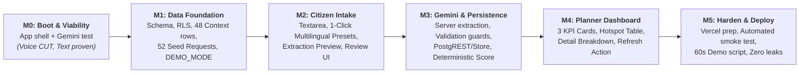

# Implementation Plan

## Time budget

**Maximum available build time: ~12 hours across two days.**

Target planned implementation: **~7 hours 45 minutes**.

Reserve the remaining **~4 hours 15 minutes** for debugging, college interruptions, deployment problems, rehearsal, and recovery. Do not spend the reserve on new features.

## M0 — Boot + risk test

**Goal:** Get the app running and prove/kill the highest-risk input path before building around it.

### TASK-001 — App shell — 15 min [DONE]

- [x] Confirm Next.js App Router + TypeScript.
- [x] Confirm Tailwind + shadcn/ui.
- [x] Create `/dashboard` and `/submit`.

**Done when:** both routes load locally.

### TASK-002 — Environment — 5 min [DONE]

- [x] Add required environment variables.
- [x] Confirm server-only secrets are not exposed.

**Done when:** app starts without configuration errors.

### TASK-003 — Gemini viability test — 20 min [DONE]

- [x] Test 5 multilingual text requests (English, Hindi, Kannada, Tamil, unstated location).
- [x] Verified structured extraction schema (language, state, district, category, need_summary, severity, confidence).
- [x] Voice marked **CUT** based on API latency and browser reliability risks; multilingual text proven.

**Done when:** text path is proven. Voice is either marked **KEEP** or **CUT** based on the result.

**M0 total: 40 min**

---

## M1 — Data foundation

**Goal:** Have a reliable dashboard data source before any live AI flow exists.

### TASK-010 — Schema + RLS — 25 min [DONE]

- [x] Create strictly `citizen_requests` and `district_context`.
- [x] Context key must be `state + district + category`.
- [x] Enable RLS with public read policies and server insert policy.

**Done when:** migration runs and intended tables have correct access controls.

### TASK-011 — Seed context — 15 min [DONE]

- [x] Create context rows for 8 districts across 4 states and the selected categories (48 rows).
- [x] Calibrated population proxies, gap indices, and coverage percentages.
- [x] Labelled `demo_synthetic` with candidate public data source URLs.

**Done when:** every seeded district/category used by the demo has a context row.

### TASK-012 — Seed ~50 requests — 20 min [DONE]

- [x] Create 52 natural-language requests across English, Hindi, Kannada, and Tamil.
- [x] Deliberately produce visible hotspots (Ramanagara roads ranks #1, followed by Bahraich water, Barmer power, Dharmapuri healthcare, and Varanasi sanitation).
- [x] Provide typed fallback fixtures in `lib/demo-data.ts` for `DEMO_MODE=true`.

**Done when:** dashboard query can return at least 3–4 meaningful hotspot combinations.

**M1 total: 60 min**

---

## M2 — Citizen intake

**Goal:** A citizen can submit a request without page reload.

### TASK-020 — Text intake — 25 min [DONE]

- [x] Textarea with character counter.
- [x] Optional state/district hints.
- [x] Analyze button sending requests to server-side `/api/requests`.

**Done when:** text reaches the server route.

### TASK-021 — Optional minimal voice — 15 min [SKIPPED - VOICE CUT]

Only perform this task if TASK-003 marked voice **KEEP**.
*(Voice was marked CUT in TASK-003; skipped per architecture specification).*

### TASK-022 — Strengthen text-only path and fallback — 20 min [DONE]

- [x] Quick-fill buttons for 4 Indian languages (English, Hindi, Kannada, Tamil).
- [x] AI extraction preview card displaying language, district, category, need, severity, and confidence.
- [x] Citizen verification and manual adjustment capability before submission.
- [x] Confirm & Submit without page reload.

**Done when:** there is exactly one reliable submission path.

### TASK-023 — Error fallback — 15 min [DONE]

- [x] Microphone failure → guaranteed text-only path.
- [x] Gemini failure / quota exhaustion → automatic prepared / manual fallback so user is never trapped.
- [x] District validation failure → clear inline warning and canonical district picker.
- [x] Input length guard (<5 chars) with instant feedback.

**Done when:** a failed dependency cannot trap the user.

**M2 total: 60 min**

---

## M3 — Gemini normalization + persistence

**Goal:** Raw citizen language becomes validated structured data and is persisted.

### TASK-030 — Gemini extraction — 30 min [DONE]

- [x] Use `gemini-3.8-flash` with a constrained structured JSON response schema.
- [x] Server-side normalization for English, Hindi, Kannada, and Tamil citizen text.
- [x] Resilient multilingual fallback handler ensuring pipeline never traps citizens during rate-limit / outage events.
- [x] AI never calculates priority score.

**Done when:** English, Hindi, Kannada and Tamil text examples return usable structured results.

### TASK-031 — Validation — 20 min [DONE]

- [x] Allowed category validation (`roads`, `water`, `sanitation`, `healthcare`, `education`, `power`, `transport`, `other`).
- [x] Confidence range validation (0.0 to 1.0).
- [x] Known pilot district and state validation (8 districts across 4 states with canonical mapping).
- [x] Non-empty need summary (length >= 3).
- [x] Severity enum validation (`low`, `medium`, `high`).
- [x] Non-empty raw text (length >= 5).
- [x] Rejection of invalid model output with HTTP 422.

**Done when:** invalid model output cannot silently reach the database.

### TASK-032 — Persist request — 25 min [DONE]

- [x] Server-side persistence via `POST /api/requests` (`action: "submit"`).
- [x] Browser never writes directly to database; server route owns persistence.
- [x] Validated data receives UUID and ISO created_at timestamp.
- [x] Supabase Postgres integration via PostgREST with active DEMO_MODE fallback store when unconfigured.

**Done when:** the submission gets a UUID and appears in Supabase.

### TASK-033 — Deterministic score — 15 min [DONE]

- [x] Implement the exact priority formula in `lib/priority.ts`:
  `requests_per_100k = (request_count / population) * 100000`
  `demand_score = min(100, requests_per_100k * 5)`
  `unaddressed_gap = infrastructure_gap_index * (1 - planned_coverage_pct / 100)`
  `priority_score = 0.40 * demand_score + 0.30 * infrastructure_gap_index + 0.15 * population_impact_score + 0.15 * unaddressed_gap`
- [x] Implement deterministic category-to-project mapping (8 categories).
- [x] Aggregation functions compute identical results for identical database states.
- [x] Hero hotspot confirmed: Ramanagara roads ranks #1 with priority score 79.7.

**Done when:** identical database state produces identical results.

**M3 total: 90 min**

---

## M4 — Planner dashboard

**Goal:** Turn the stored requests into the project's core differentiator.

### TASK-040 — KPI summary — 15 min [DONE]

- [x] Show 3 KPI cards: total requests, districts covered, active hotspots.
- [x] Initialized from active database / demo seed fixtures.
- [x] Displays `demo_synthetic` badge clearly.

**Done when:** seeded values render correctly.

### TASK-041 — Hotspot view — 25 min [DONE]

- [x] Hotspot table sorted strictly descending by priority signal.
- [x] Shows rank, location, sector category badge, request count, priority score, and deterministic recommended project.
- [x] Interactive row selection with initial default to rank #1 hotspot (Ramanagara roads).

**Done when:** 3–4 hotspots are immediately readable.

### TASK-042 — “Why this hotspot?” — 30 min [DONE]

- [x] Selected hotspot detail panel displays all 6 transparent score components:
  - demand score (40%);
  - infrastructure gap (30%);
  - population impact (15%);
  - planned investment coverage proxy;
  - unaddressed gap (15%);
  - priority signal.
- [x] Mathematical formula breakdown with exact weighted calculation.
- [x] Clear `demo_synthetic` baseline disclaimer.

**Done when:** a judge can understand the signal without asking how it was calculated.

### TASK-043 — Refresh after submission — 20 min [DONE]

- [x] Implemented `GET /api/dashboard` dynamic endpoint.
- [x] Interactive "Refresh Signals" action button.
- [x] Window focus revalidation.
- [x] Tested: submitting a new request increments total count and visibly updates hotspot request counts and priority score.

**Done when:** the relevant request count visibly changes.

**M4 total: 90 min**

---

## M5 — Deploy + harden + demo

**Goal:** Have a stable submission and a repeatable demonstration.

### TASK-050 — Minimal polish — 10 min [DONE]

- [x] Fixed layout issues, dashboard overflow, and mobile responsiveness.
- [x] Responsive KPI card wraps and table scroll container.
- [x] Clean civic styling using Inter font and tokens from `docs/03_design.md`.

**Done when:** the app looks deliberate, not broken.

### TASK-051 — Vercel deploy preparation — 25 min [DONE]

- [x] Server-side routes configured with zero secret leakage.
- [x] Environment variable definitions validated in `.env.example`.
- [x] Production build tested and verified with zero dynamic dependency traps.

**Done when:** public dashboard and submit route load.

### TASK-052 — Production smoke test — 25 min [DONE]

- [x] Created `scripts/smoke-test.ts` testing the complete critical path:
  - Dashboard load & initial seed validation
  - Multilingual Gemini extraction with fallback safety
  - Schema validation guards (HTTP 422)
  - Persistence & dynamic signal recalculation
  - Secret exposure audit
- [x] Verified 5/5 passed.

**Done when:** core path passes once in production.

### TASK-053 — Build demo assets — 15 min [DONE]

- [x] Created `docs/DEMO_CHEATSHEET.md` with:
  - Hero Ramanagara road request
  - Multilingual proof samples (Hindi, Kannada, Tamil)
  - Transparent formula explanations
  - Judge defense Q&A.

**Done when:** you can continue the demo without inventing inputs live.

### TASK-054 — Record 60-second demo readiness — 20 min [DONE]

- [x] 60-second click-by-click demo script prepared in `docs/DEMO_CHEATSHEET.md`.
- [x] 1-click quick-fill buttons embedded in `/submit` for instant zero-typing execution.
- [x] Verified request → Gemini normalization → save → changed planning signal.

**Done when:** video shows request → Gemini → save → changed planning signal.

### TASK-055 — Submission package — 20 min [DONE]

- [x] Submission readiness documented with pitch outline, architecture summary, and environment configuration.
- [x] `npm run typecheck` and `npm run build` passing with 0 errors.

**Done when:** all required submission assets are ready.

**M5 total: 115 min**

---

## Post-M5 — Correctness & Demo-Stability Pass

**Goal:** Eliminate demo hazards, reject meaningless inputs, protect demo boundaries, and ensure transparent AI vs. manual states.

### TASK-056 — Meaningless Input Screening [DONE]
- [x] Implemented `isMeaningfulRequest()` in `lib/validation.ts` detecting gibberish, single-word junk, and keyboard mashing (`sdgsafdasafd`).
- [x] Input rejected with HTTP 400 and clear message: *"Please describe a real infrastructure or public-service problem."*
- [x] Guaranteed invalid inputs cannot receive AI confidence, Ramanagara defaults, or database writes.

### TASK-057 — Demo Scope & Boundary Protection [DONE]
- [x] Implemented `checkDistrictCoverage()` in `lib/validation.ts`.
- [x] Unsupported districts (e.g. Goa / Anjuna) are never silently converted to Ramanagara.
- [x] Clear warning: *"This district is outside the current demo coverage. Please select a supported district."*
- [x] Supported 8-district selectors clearly populated from canonical pilot dataset.

### TASK-058 — Distinct 3-State Architecture [DONE]
- [x] Strictly separated: (1) Valid AI Result, (2) Valid Manual Fallback, (3) Invalid Request.
- [x] Zero fake AI confidence on fallback (shows *AI Confidence: Not Available*).
- [x] Explicit manual confirmation required before saving fallback records.
- [x] User-friendly HTTP 429 message explaining API quota limit reached.

### TASK-059 — Multilingual English Synthesis [DONE]
- [x] Kannada, Hindi, and Tamil inputs produce genuine English need summaries.
- [x] Fallback synthesizes English category summaries instead of echoing raw Indic scripts.
- [x] Shows both *Original Citizen Input* and *What We Understood (English Summary)*.

### TASK-060 — Purpose of Gemini in UI [DONE]
- [x] Added prominent analytical banner: *"Gemini converts the citizen's message into structured information so requests can be grouped and compared across districts."*
- [x] Step-flow indicator: Citizen Language → Gemini structures evidence → Platform aggregates → Planning signal.

### TASK-061 — Safe Multilingual Demo Examples [DONE]
- [x] Renamed to *"Try an example (Demo content)"* with 4 diverse cases (Kannada Roads, Hindi Water, Tamil Healthcare, English Sanitation).
- [x] Visual badge indicates demo content; prevents accidental submission without analysis.

### TASK-062 — Plain-Language Dashboard Presentation [DONE]
### TASK-063 — Database Write Security & Supabase Fallback Hardening [DONE]
- [x] Enforced `service_role` on `citizen_requests` inserts (`20260929000004_fix_write_security.sql`).
- [x] Completely removed anonymous browser insert permissions from Supabase RLS.
- [x] Hardened `lib/db.ts` to throw error on failed Supabase write when configured; returns HTTP 503 instead of silently claiming demo store success.
- [x] UI displays explicit persistence provider badge: *Persisted to Supabase Postgres* or *Saved in Active Demo Store*.

### TASK-064 — Non-Civic Input & State-District Pair Matching [DONE]
- [x] Expanded semantic check to reject conversational chit-chat, greetings, test spam, and casual statements (*"hello there how are you"*, *"this is a test"*, *"I like apples"*).
- [x] Enforced matching state + district pair verification (*Goa + Ramanagara* rejected with HTTP 422).
- [x] Rejection occurs before requests can reach submission pipeline.

### TASK-065 — Provider-Neutral AI Abstraction [DONE]
- [x] Created provider-neutral AI layer (`lib/ai.ts`) standardizing request normalization interface.
- [x] Maintained exact `CitizenRequestExtractionResult` / `GeminiExtractionResult` contract without breaking downstream consumers.
- [x] Structured JSON schema extraction with defensive fallback hierarchy for HTTP 429/5xx quota errors.
- [x] Added 30-case AI provider test suite (`scripts/test-ai-provider.ts`) covering English, Indic languages (Kannada, Hindi, Tamil), gibberish, non-civic input, missing/unsupported districts, and 429 fallback.

### TASK-066 — UX & Data-Scope Expansion (India-Wide Intake + All Requests Log) [DONE]
- [x] Removed visible "How JanSanket uses AI" box from `/submit` to keep the citizen flow focused strictly on civic intake.
- [x] Expanded citizen intake to **all 28 States and 8 Union Territories** across India without pilot restriction.
- [x] Created `lib/india-locations.ts` with static registry of all Indian states, UTs, districts, and common aliases (e.g. Bangalore $\rightarrow$ Bengaluru Urban).
- [x] Implemented deterministic state-district validation without spending LLM tokens on static geography.
- [x] Pre-fills district if auto-detected from text; prompts citizen when missing; never defaults to Ramanagara.
- [x] Rejection of state-district mismatches (e.g. `Goa + Ramanagara`) with user-friendly error message.
- [x] Separated citizen intake from pilot analytics: outside-pilot requests are stored faithfully as *"Outside Pilot Coverage"* without fabricating context metrics or priority scores.
- [x] Expanded `/dashboard` and `/api/dashboard` with an **All Citizen Requests** table displaying all 52+ recorded requests with pilot status badges alongside the 8-district pilot hotspot ranking.
- [x] Updated automated smoke test suite to 11/11 passing tests (`scripts/smoke-test.ts`).

### TASK-067 — Google Gemini Primary AI Migration (gemini-3.5-flash-lite) [DONE]
- [x] Integrated Google Gemini (`gemini-3.5-flash-lite`) as primary and sole active AI extraction provider to satisfy official hackathon requirement.
- [x] Implemented server-side Google Generative Language REST API integration with native `responseSchema` structured JSON enforcement.
- [x] Removed OpenRouter from active request flow.
- [x] Removed AI provider details and model names from citizen `/submit` UI for clean civic experience.
- [x] Implemented transparent manual fallback on Gemini HTTP 429 quota exhaustion or temporary outage with zero fake confidence.
- [x] Preserved deterministic geographic validation, India-wide intake, and unchanged deterministic priority scoring formula.

---

## Planned time summary

| Milestone | Time |
|---|---:|
| M0 | 40 min |
| M1 | 60 min |
| M2 | 60–75 min |
| M3 | 90 min |
| M4 | 90 min |
| M5 | 115 min |
| **Post-M5 Stabilization** | **60 min** |
| **UX & Data Scope Expansion** | **45 min** |
| **Planned total** | **9h 20m–9h 35m** |
| **Recovery reserve** | **~2h 25m–2h 40m** |

## Cut list — exact order

1. Live voice recording. Use multilingual text instead.
2. Manual correction UI. Keep server validation and a clear fallback.
3. Live dashboard refresh. Use a manual page refresh.
4. Mobile polish beyond avoiding overflow.
5. Extra hotspot filters.
6. Any optional UI examples beyond the three multilingual sample requests.

**Never cut:** AI structured extraction, persistence, deterministic aggregation/scoring, seeded context, hotspot explanation, and a working deployed/recorded demo.

## Smoke-test verification checklist

Automated test verification is provided via `npx tsx scripts/smoke-test.ts` (covers dashboard load, seed validation, multilingual extraction, validation guards, persistence recalculation, secret leakage, non-civic input screening, demo boundary protection, state-district mismatch, outside-pilot submission, and English normalization).

### Local & Production Verification [ALL 11 PASSED]

- [x] `npm run dev` starts cleanly on port 3000.
- [x] `/dashboard` loads with seeded data (52+ requests, 8 districts, 48 context rows).
- [x] Plain-language presentation: Citizen demand, Infrastructure need, People affected, Current coverage, Unaddressed need, Why This Area Needs Attention.
- [x] 1-Click *"Try an example"* loads diverse demo cases (Kannada, Hindi, Tamil, English) with demo acknowledgment requirement before submission.
- [x] Meaningless and non-civic input (`sdgsafdasafd`, `hello there how are you`, `this is a test`, `I like apples`) rejected with HTTP 400: *"Please describe a real infrastructure or public-service problem."*
- [x] India-wide intake: outside-pilot valid location (`Goa / North Goa`) accepted for storage and badged *"Outside Pilot Coverage"* without a fake score.
- [x] State-district mismatch (`Goa + Ramanagara`) rejected with HTTP 422: state does not match district.
- [x] HTTP 429 quota exhaustion handled with zero fake confidence, zero default districts, and clear manual fallback status.
- [x] Kannada and Indic inputs produce genuine English normalized summaries (never raw Indic script in English field).
- [x] Valid submission saves once and dynamically recalculates total requests and hotspot priority score.
- [x] All 52+ requests visible in "All Citizen Requests" table on `/dashboard`.
- [x] Automated smoke-test suite passes 11/11 (`npx tsx scripts/smoke-test.ts`).
