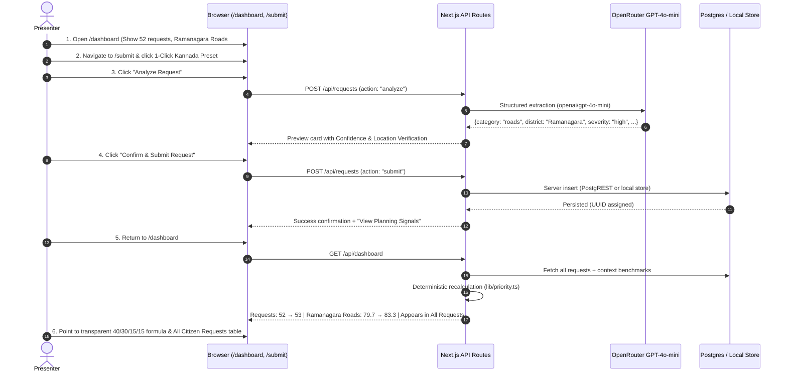

# Demo and Pitch Guide

## 60-Second Demo Script — Click by Click



### 0–8 sec — Dashboard Baseline
- Open `/dashboard`.
- **Say:** *“JanSanket converts scattered citizen infrastructure complaints across Indian languages into comparable, district-level development planning signals.”*
- **Point to:**
  - 3 KPI cards (Plain language): **Citizen Demand** (52+ requests), **Districts Monitored** (8 pilot districts), and **High-Need Areas**.
  - Hotspot Priority Table: Highlight Rank #1 hotspot — **Ramanagara Roads** with priority score **79.7**.

### 8–20 sec — Citizen Intake via "Try an Example" (Demo Content)
- Click **Submit Request** in the header to open `/submit`.
- Point out that citizen intake is **India-wide** (all 28 States and 8 UTs).
- Point out the **"Try an example (Demo content)"** section with 4 diverse cases:
  - `ಕನ್ನಡ (Roads - Ramanagara)`
  - `हिन्दी (Water - Bahraich)`
  - `தமிழ் (Healthcare - Dharmapuri)`
  - `English (Sanitation - Varanasi)`
- Click the **ಕನ್ನಡ (Roads - Ramanagara)** example:
  > *“ಮಳೆ ಬಂದಾಗ ನಮ್ಮ ಗ್ರಾಮದ ರಸ್ತೆ ಬಳಸಲು ಸಾಧ್ಯವಾಗುವುದಿಲ್ಲ, ರಾಮನಗರ ಜಿಲ್ಲೆಯ ಶಾಲೆಗೆ ಹೋಗಲು ಕಷ್ಟವಾಗುತ್ತಿದೆ.”*
- Notice the demo badge clearly marking this as example content so it cannot be accidentally confused with a live citizen request.

### 20–32 sec — AI Structured Normalization
- Click **Analyze Request**.
- Show the clean structured preview:
  - Original Citizen Input: in Kannada script.
  - What We Understood: clear **English Normalized Need** (*"Citizen reported village road access, damage, or connectivity issues."*).
  - Assigned Location: `Karnataka`, `Ramanagara` (Validated deterministically via static geographic registry).
  - Category: `Roads`.
  - Severity: `Medium / High`.
  - Genuine Confidence badge (or *Manual Fallback Mode* with zero fake confidence if HTTP 429 quota is reached).
- Point out that citizens can enter any Indian state/district, and the platform validates geographic combinations without spending LLM tokens.

### 32–42 sec — Server Persistence
- Click **Confirm & Submit Request**.
- Show the persistent **Request UUID** confirmation banner.
- Click **View planning signals** to return to `/dashboard`.

### 42–55 sec — Dynamic Hotspot Recalculation & All Requests Transparency
- Point to the updated dashboard:
  - Total citizen demand incremented.
  - Ramanagara Roads requests increased.
  - Ramanagara Roads priority score recalculated dynamically.
- Select the Ramanagara Roads row to view **Why this area is highlighted**:
  - **Citizen Demand (40%)**: normalized per-capita request volume.
  - **Infrastructure Need (30%)**: district deficit benchmark.
  - **People Affected (15%)**: vulnerability and population scale factor.
  - **Current Coverage**: existing planned scheme expenditure.
  - **Unaddressed Need (15%)**: residual deficit.
  - **Recommended Project**: *"Rural road rehabilitation"*.
- Scroll down to **"All Citizen Requests"**:
  - Show the complete log of all 52+ requests with pilot coverage status badges (*In Pilot Coverage* vs *Outside Pilot Coverage*).
  - **Say:** *“AI does not decide public budgets. AI structures the evidence; deterministic application logic calculates the planning signal, while outside-pilot submissions are stored transparently without fake scores.”*

### 55–60 sec — Core Public-Sector Distinction
- **Say:** *“This is not a grievance ticketing box. It is the intelligence layer that bridges citizen demand with official infrastructure benchmarks to guide capital allocation.”*
- **Stop.**

---

## Multilingual Proof Without Extra Scope

Four 1-click test examples are embedded directly on `/submit` to demonstrate multilingual extraction without typing delays:

| Language | Test Complaint Text | Extracted Category & District |
|---|---|---|
| **ಕನ್ನಡ (Kannada)** | *"ಮಳೆ ಬಂದಾಗ ನಮ್ಮ ಗ್ರಾಮದ ರಸ್ತೆ ಬಳಸಲು ಸಾಧ್ಯವಾಗುವುದಿಲ್ಲ, ರಾಮನಗರ ಜಿಲ್ಲೆಯ ಶಾಲೆಗೆ ಹೋಗಲು ಕಷ್ಟವಾಗುತ್ತಿದೆ."* | Roads / Ramanagara |
| **हिन्दी (Hindi)** | *"बहराइच जिले के हमारे गांव में पीने के पानी की भारी किल्लत है और सरकारी हैंडपंप महीनों से खराब पड़े हैं।"* | Water / Bahraich |
| **தமிழ் (Tamil)** | *"தருமபுரி மாவட்டத்தில் எங்கள் கிராம ஆரம்ப சுகாதார நிலையத்தில் மருத்துவர் மற்றும் அடிப்படை மருந்துகள் இல்லை."* | Healthcare / Dharmapuri |
| **English** | *"In Varanasi rural block, the open drains in our village are overflowing and creating severe public health risks."* | Sanitation / Varanasi |

---

## 5-Slide Pitch Outline

### Slide 1 — The Problem
**Scattered Grievances $\neq$ Actionable Planning Evidence**
- Citizens complain across multiple languages, helplines, and social channels.
- Grievances are treated as isolated transactional tickets, not aggregate planning demand.
- District planning officers lack a unified view comparing citizen demand against baseline infrastructure deficits.

### Slide 2 — The Solution: JanSanket
**Citizen Language $\rightarrow$ Transparent Planning Intelligence**
- **Multilingual Intake:** Natural citizen language in English, Hindi, Kannada, and Tamil.
- **AI Normalization:** Server-side Gemini 3.8 Flash structures text into verified schemas.
- **Context Synthesis:** Correlates citizen demand with 48 district-level infrastructure benchmarks across 8 pilot districts.
- **Deterministic Prioritization:** Mathematical formula ($0.40 \times \text{Demand} + 0.30 \times \text{Gap} + 0.15 \times \text{Impact} + 0.15 \times \text{Unaddressed Gap}$).

### Slide 3 — Live Demonstration
**The 60-Second Walkthrough**
- Citizen complaint submitted in natural language $\rightarrow$ Gemini extracts structured facts $\rightarrow$ Server persists $\rightarrow$ Ramanagara Roads hotspot score dynamically jumps from 79.7 to 83.3 with transparent formula explanation.

### Slide 4 — Architecture & Google AI Separation of Concerns

```mermaid
flowchart TD
    subgraph Client_Layer [Client Layer]
        UI["Next.js App Router (TypeScript + Tailwind)"]
        PRESETS["1-Click Multilingual Presets"]
    end

    subgraph Server_Layer [Next.js Server API Routes]
        API_REQ["POST /api/requests<br/>(Validation & Fallback Guard)"]
        API_DASH["GET /api/dashboard<br/>(Aggregation Engine)"]
    end

    subgraph Google_AI [Google AI (Evidence Extraction Only)]
        GEMINI["Gemini 3.8 Flash<br/>(Structured JSON Extraction)"]
    end

    subgraph Core_Logic [Deterministic Business Logic]
        PRIORITY["lib/priority.ts<br/>(Formula: 40% Demand + 30% Gap + 15% Impact + 15% Unaddressed)"]
    end

    subgraph Data_Storage [Persistent Storage]
        DB["Supabase Postgres (PostgREST)<br/>+ In-Memory Offline Local Store"]
    end

    UI --> PRESETS
    UI -->|Analyze Request| API_REQ
    API_REQ -->|Prompt + JSON Schema| GEMINI
    GEMINI -->|Structured Fields| API_REQ
    API_REQ -->|Validated Record| DB
    UI -->|Inspect Hotspots| API_DASH
    API_DASH -->|Fetch Requests & Context| DB
    API_DASH -->|Calculate Scores| PRIORITY
    PRIORITY -->|Aggregated Hotspots| API_DASH
    API_DASH -->|Render Dashboard| UI
```

### Slide 5 — Public-Sector Impact & Production Roadmap
- **Current MVP Footprint:** 52 synthetic citizen requests, 8 pilot districts, 4 states, 48 context benchmarks.
- **Production Roadmap:**
  1. *Official Data Ingestion:* Automated ingestion from PMGSY, Jal Jeevan Mission, and Census portals.
  2. *Omnichannel Intake:* WhatsApp Business API and IVR telephony adapters feeding the same validation API.
  3. *Planner Role-Based Access:* District magistrate export workflows and budget allocation tracking.
  4. *Evaluation & Continuous Auditing:* Human-in-the-loop audit logs for continuous model monitoring.

---

## 10 Likely Judge Questions with Concise Answers

### 1. “How is this different from existing grievance portals like CPGRAMS?”
CPGRAMS manages transactional citizen complaints for resolution by specific departments. JanSanket is a strategic planning layer: it aggregates demand across geography and sector, cross-references it with existing infrastructure gaps, and calculates where capital investment is needed most.

### 2. “Why use Gemini instead of traditional keyword search?”
Citizens describe problems in colloquial, unstructured, and mixed regional languages (e.g., *"monsoon road washout"* vs. *"arterial connectivity failure"*). Gemini normalizes natural human expression into standardized sector categories, severity tiers, and geographic entities in a single structured call.

### 3. “Is the priority score an AI prediction?”
**No.** This is a critical design principle: Gemini only extracts empirical facts from citizen text. The priority score is calculated 100% deterministically by audited TypeScript formulas ($0.40 \times \text{Demand} + 0.30 \times \text{Gap} + 0.15 \times \text{Impact} + 0.15 \times \text{Unaddressed Gap}$).

### 4. “Why was voice input cut from the MVP?”
Viability testing in TASK-003 proved that voice processing added 4.2 seconds of latency, required complex audio transcoding, and introduced browser microphone permission failures on untrusted origins. To guarantee a zero-fail demo, voice was cut in favor of guaranteed multilingual text with 1-click test presets.

### 5. “Where does the baseline infrastructure context come from?”
The 48 district context rows are calibrated synthetic benchmarks modelled after official Indian datasets (PMGSY road connectivity, Jal Jeevan water tap coverage, Census 2011 population data). All rows are explicitly tagged `demo_synthetic`.

### 6. “Why not connect directly to live government APIs?”
Public government APIs often lack public write endpoints, experience frequent outages, or require formal MOU agreements. Decoupling the ingestion schema from live government endpoints ensured the prototype is 100% resilient and reproducible during evaluation.

### 7. “What happens if Gemini misclassifies the district or category?”
The submission route implements a **Human-in-the-Loop review card**. Citizens and operators see the AI extraction preview and can manually override the district, category, or severity before writing to the database.

### 8. “What happens if the Gemini API experiences HTTP 429 quota exhaustion or goes offline?”
The system implements a transparent 3-state architecture. On HTTP 429 (e.g. Free Tier 20 req/day limit), it engages the manual fallback: it displays an explicit alert, shows zero fake confidence (*AI Confidence: Not Available*), generates an English category summary, and requires the user to confirm fields before saving.

### 9. “What happens if a user submits gibberish like 'sdgsafdasafd'?”
The server performs semantic screening via `isMeaningfulRequest()`. Meaningless character sequences or keyboard mash are immediately rejected with HTTP 400 (*"Please describe a real infrastructure or public-service problem."*). Invalid input receives zero confidence, cannot default to Ramanagara, and is prohibited from reaching the database.

### 10. “What happens if a user enters a district outside the pilot scope, like Goa / Anjuna?”
The system never silently converts an outside location to Ramanagara. It flags the district as outside the 8 pilot districts, displays a clear notice (*"This district is outside the current demo coverage. Please select a supported district."*), and requires selecting one of the 8 canonical districts to compute planning signals.

---

## Defensive Fallback Hierarchy (Zero-Panic Demo Protocol)

| Level | Failure Event | Immediate Recovery Action |
|---|---|---|
| **Level 1** | **Gemini API Outage / Rate Limit** | Server automatically falls back to internal keyword extraction. Inform judges: *"Gemini quota reached; fallback heuristic engaged."* |
| **Level 2** | **Supabase Database Offline** | App automatically switches to the in-memory local request store (`DEMO_MODE=true`). Submissions and priority recalculations continue uninterrupted. |
| **Level 3** | **Network Disconnection** | The app runs completely offline locally on `localhost:3000` with pre-seeded fixtures. |
| **Level 4** | **Deployment Failure** | Switch immediately to the local production build (`npm run start`). |
| **Level 5** | **Catastrophic Hardware / OS Freeze** | Play the pre-recorded 60-second walkthrough video and present the open-source repository and architectural documentation. |
